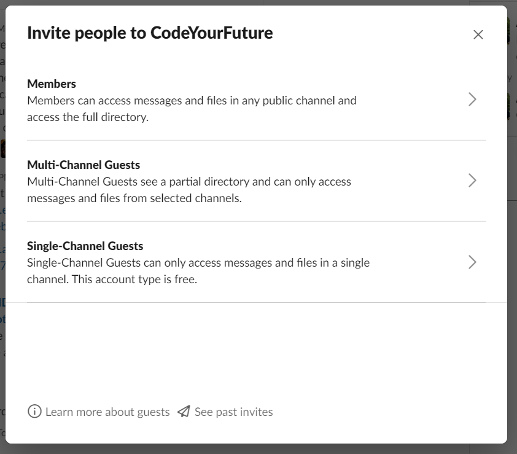

# Homework Mentor Training

## What is a Homework Mentor?

## Training

### Why do we mentor? \(5 minutes\)

_If the group is smaller than six people_

As a form of icebreaker and a way to get to know each other have everybody introduce themselves and say:

* Their name 
* Where they're from
* What they do
* Why they want to mentor or why they see the importance in mentoring

The aim of this discussion is to explore the reasons that people are volunteering with us. 

_If the group is larger than six people_

Split the group into smaller groups of 3 or 4 people, then complete the above exercise

### What is our commitment to you? \(5 minutes\)

We commit to have students who are engaged, willing to learn, inquisitive, respectful and looking to change their lives through hard work. 

We endeavour to work to the mantra 

> Never teach alone

This means that whilst you may physically be alone with our students we will support you with online support in our Slack channel and teaching material to help our students. If you ever struggle or have problems teaching our students we are here to support you.

Finally, we want to give back to them by providing teaching lessons and a community of people who are committed to real change. 

### Course Details \(5 minutes\)

### Setup \(5 minutes\)

#### Slack

You should gather all of the attendees emails and invite them to the slack channel [_\#cyf-homework-mentors_.](https://app.slack.com/client/T2H71EFLK/C010MDVT37G)

**It is important you invite them as Single-Channel Guests so we don't hit our member limit.** You can invite them as Single-Channel Guests from here:

Then click here:

#### Sign Up Sheet

Introduce the volunteers to the sign up sheet here:



This sheet is used to coordinate our 

### Wrap-up

* Share this document with the attendees so they can look over the notes
* Encourage them to read the rest of the content on this website
* Encourage them to explore the content on [docs.codeyourfuture.io](https://docs.codeyourfuture.io)
* Ask them to sign up to a time over the next week that they would like this mentor a student

