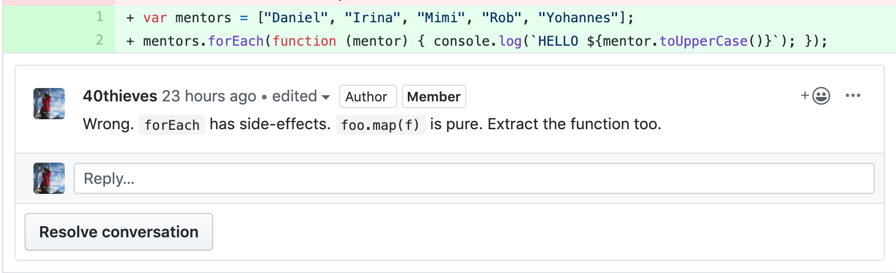
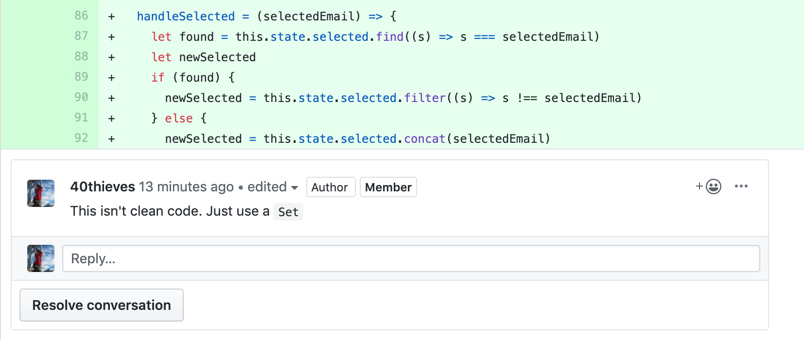

# Motivation & Demotivation

## Presentation Slides



## Learning Objectives

* Teachers/TAs can identify demotivating language/attitudes
* Teachers/TAs can identify ways of motivating students

## Demotivating Comments

**Exercise**

Rewrite the following review comments to be less demotivating to the person receiving them:

\[Alt text: Wrong. forEach has side-effects. foo.map\(f\) is pure. Extract the function too.\]

\[Alt text: This isn't clean code. Just use a Set\]

**Discussion**

Some demotivating language/attitudes to watch out for:

* Suggesting \(intentionally or not\) that some people are natural programmers and some are not. Studies have shown that this is not the case. This is sometimes called fixed mindset vs growth mindset
* Stereotype threat or microaggressions: reminding people about negative stereotypes can make them anxious about the risk of confirming those stereotypes. We try to be inclusive in class and in our examples and exercises
* A contemptuous attitude: treating other people or things as lesser or worthless. A common pitfall is the word “just” \(e.g. “just install this package”, ”just use this pattern”\)
* Comments/jokes about other technologies, e.g. Unix vs Windows, vim vs emacs, other programming languages vs JavaScript. The students are more likely to interpret these literally, applying the negativity to themselves or others

## Motivating students

**Exercise**

In pairs, list half a dozen things you did this week in your job that use the skills we teach. Report your findings back to the group.

**Examples**:

* Helped a colleague to debug a problem by eliminating possibilities
* Extracted functionality

**Discussion**

This is where your expertise & experience shines! You can put what we teach in context.

Some suggestions that motivate students:

* Use authentic tasks: something that learners believe they would actually do in real life \(e.g. making a menu open when a button is clicked\). Or the flip-side of this, avoid using examples like var foo = "bar";
* Draw on your experience to show how the things you are teaching are relevant in your day-to-day job. Remember that students often have no idea what a programmer does daily
* Share your imposter syndrome \(the belief that a person's achievements are lucky flukes and a fear that "someone will finally figure this out"\). We encourage you to share stories of when you made mistakes so that students know that it is OK to find programming hard

