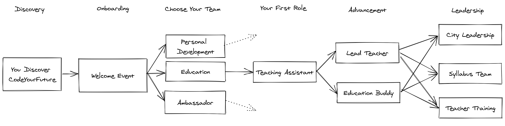

# Welcome to the Education Team

## Projected Time

This training will take roughly 90 minutes to complete.

## Aims

By the end of this training you should be able to

* Describe the core pedagogy of CodeYourFuture
* Categorise the responsibilities of different roles at CodeYourFuture
* Understand your next steps into the Education Team
* Plan where you want to take your CodeYourFuture journey

## Prior Knowledge

To take part in this training you are expected to 

* have attended a Welcome or Onboarding event for CodeYourFuture
* want to be a part of the Education Team

## Slides



## Training 

### The Pedagogy of CodeYourFuture

#### 1\) Communitised Learning

Our lessons are community events

* No one person dominates the lesson
* We use lots of people to provide individual support
* We promote group based activities

#### 2\) Anti-Lecture Lesson Structure

The taught content can \(and should\) take the form of a variety of techniques including

* Taught examples
* Live coding
* Group Discussions
* Videos, Case Studies

#### 3\) Fear Reducing Lessons

The aims of our lessons are too

* Prepare our students for their coursework
* Introduce new concepts in a managed and pedagogically satisfactory way
* Provide support and community for the students \(and for you!\)

### Your Journey with CodeYourFuture

### Education Team Roles

At it's highest level the mission of the Education Team is to 

> Create an inclusive learning community that communitises failure, encourages growth through challenge and provides support to those that need it most.

In practically what this means is the course services that we provide to our students

* Community, class based learning once a week - **our lessons on Saturday/Sunday**
* Dedicated support structures during the week - **our Buddy Mentoring system**
* A 24 hour community of fellow learners - **our online community on Slack**

These tasks are broadly separated into roles undertaken by different people at different times.

* Lead Teacher
* Teaching Assistant
* Syllabus Team
* Education Buddy
* Education Director

#### Exercise 

Take a look at the Google Sheet below.   
  
In it, you'll find a column of tasks that members of the Education Team undertake and a row of roles at CodeYourFuture.



1. Split into Groups
2. One person, create a Copy of this Google Sheet
3. Share your screen with your group
4. Copy & Paste each of the tasks in to each column as you see fit.

**Note**: Each task might fit into more than one column!

When you've finished we'll re-group and discuss.

### Tools

#### Slack

On your journey to becoming a volunteer at CodeYourFuture you will recieve access to our Slack Workspace. This is where all of our communication happens and were are classes take place.

If you haven't already we ask you to

* Set your name as your real name
* Set your display picture as picture of you \(or a cartoon picture of you if you'd prefer\)

In addition to the normal rules of Slack \(e.g. use Threads, don't use @channel, etc \) we operate on a single golden rule

> **Communicate, coordinate and collaborate in public channels**

We're a large and growing organisation where information needs to flow smoothly - it's one of our key challenges. By communicating in direct messages or in private channels it makes it really hard for people to stay up to date why the schools. 

With that said there are some recommended channel that you join. Firstly, you should join the cities associated with you City. They will always be named with the name of your city at the front.

For example, if you are attending in the West Midlands you would want to join

> westmidlands, westmidlands-edu, westmidlands-class1

Any channels with the prefix _cyf-_ are global channels. 

You will also want to join the public channels associated with the syllabus. Firstly, there is 

> cyf-syllabus

For generic Syllabus discussion 

Then there are the specific module channels, for example

> cyf-module-html-css, cyf-module-node, cyf-module-mongodb

#### Github

We use Github to store and review homework for the students. You'll often find it linked from the Syllabus. 

For now, the most important part is that you are added as a collaborator to our \`Mentors\` Github Team

[https://github.com/orgs/CodeYourFuture/teams/mentors](https://github.com/orgs/CodeYourFuture/teams/mentors)

#### Syllabus

Our Syllabus is the home to all of our Tech Education Teaching Content



#### Docs Website

Our Docs website is where we keep all of our day to day operations materials. 



#### Exercise

Spend five minutes either reading through the Docs or the Syllabus and I want you to select two items that you either 

* Didn't know about CYF before reading
* Found interesting
* Stood out as being unusual

We'll then come back and discuss

### Your First Role at a Teaching Assistant

More details about your role can be found [here](../roles/teaching-assistant/)

### Creating Impact Now

#### Job Vacancies

We graduate a large number of students all across the UK and so are always looking for Junior Positions for our graduates - please ask your HR department at work!

## Next Steps

* Attend a Teacher Training event
* Attend Buddy Training
* Attend Lead Teacher Training

## Coursework

* Offer help to a student this week
* Read and watch content on the Teacher Training website

## Teacher Resources



